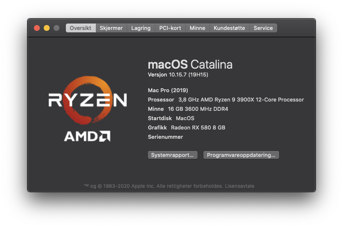

# RyzenPro-3900X-opencore

How to run Mac OS Catalina on AMD Ryzen system.
If you have a B550 motherboard you can use this EFI, but i recommend to build your own.



## Installation

The best way is to follow this guide to understand how Opencore is working

```bash
https://dortania.github.io/OpenCore-Install-Guide/AMD/zen.html
```


## Hardware

**Case:** NZXT H1 White

**Motherboard:** Gigabyte B550I AORUS PRO AX

**CPU:** AMD Ryzen 9 3900x 12Core/24 Threads

**MEM:** HyperX Fury RGB DDR4 3600MHz 16GB

**GPU:** ASUS Radeon RX 580 8GB ROG Strix Gaming 

**SSD:** 2xKingston A2000 500GB NVMe M.2 SSD


## Status

Some apps will not work with AMD CPU because of Apple hyper visor framework. 
I found a workaround for docker.

Adobe apps can have some issues, i have not tested because i dont use Adobe.

Docker for AMD systems:
https://evgeni.blog/hackintosh/docker-amd-ryzen